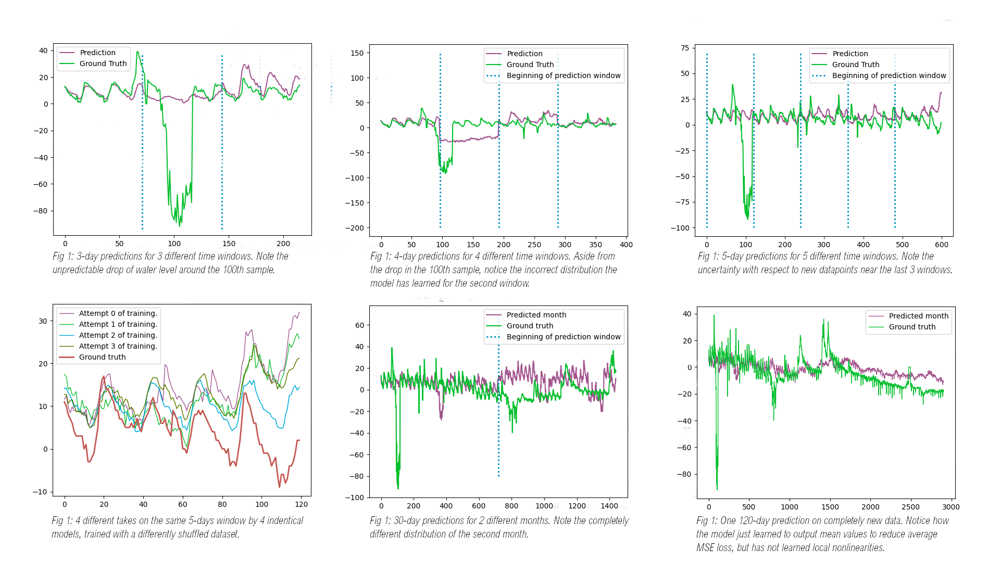

# RiverFlow


Forecasting and time-series analysis framework for hydrological data using LSTM and Seq2Seq neural networks.

## Overview


RiverFlow is a Python-based machine learning framework designed for predicting river water levels and other time-series hydrological data. It provides a **declarative configuration system** for data ingestion, feature engineering, and model training.

The system uses **LSTM and Seq2Seq encoder-decoder architectures** to capture temporal dependencies in multi-modal data (meteorological variables, satellite imagery, historical water levels).

## Core Architecture

### Data Pipeline (Declarative Syntax)

RiverFlow uses a **five-stage declarative syntax** in project files (`.decl`, `.res`, `.act`, `.sap`, `.make`):

1. **Declaration (`.decl`)** — Define input CSV/binary files and their format
2. **Resolution (`.res`)** — Type-resolve variables (numeric, categorical, boolean, integer)
3. **Action (`.act`)** — Transform and engineer features with native functions
4. **Save & Plan (`.sap`)** — Export processed data
5. **Make (`.make`)** — Construct datasets with alignment/windowing logic

### Native Feature Engineering

Built-in functions in `.act` section:
- **Normalization**: `media_zero()`, `dev_stand()`, z-score normalization
- **Outlier handling**: `azzera_outlier()`, `interpola_outlier()`
- **Noise injection**: `aggiungi_rumore()` (Gaussian, exponential, uniform)
- **Discretization**: `discretizza()` for binning continuous variables
- **Vector features**: `stack()`, `one_hot_encode()` for categorical encoding
- **Temporal support**: Sliding windows, multi-resolution alignment

### Neural Network Models

- **SimpleLSTM** — Single/dual LSTM layers with dense output for 7-day forecasting
- **SeqToSeq** — Encoder-decoder architecture with state transfer (358 units, 33% dropout)
- **Convolutional variants** — CNN-based feature extraction (research directory)

## Requirements

```
numpy >= 1.21
tensorflow
matplotlib
requests (for satellite API integration)
PIL (for image processing)
dateutil
```

## Project Structure

```
src/
├── main.py                  # LSTM training loop, model evaluation
├── seqtoseq.py             # Encoder-decoder Seq2Seq implementation
├── convolutional.py        # CNN variant experiments
├── forecast.py             # Inference and prediction utilities
├── DataOrganizer.py        # Parse declarative project files (.decl, .res, .act)
├── DatasetPlanner.py       # Temporal alignment and windowing logic
├── Padding.py              # Sequence padding with configurable strategies
├── VariableVectorAlgebra.py # N-d array operations and broadcasting
├── Feature selection.py     # Statistical feature filtering
└── api/
    ├── api.py              # NASA MODIS satellite data ingestion
    └── apierrors.py        # API error handling

examples/
├── River Height/           # Sesia river hydrological forecasting (911MB)
├── Meteo/                  # Meteorological datasets
├── Iris Dataset/           # ML baseline (classification)
└── Breast Cancer/          # ML baseline (classification)

RiverData/
├── sesia-height.csv        # 3.3M hourly water level observations
├── sesia-hourly.csv        # 926K meteorological records
├── SatelliteData/          # IMERG satellite precipitation (9.9MB)
└── eu-landscape.png        # Geographic reference overlay

resources/
├── Reportgraphs.png        # Visualization examples
└── Reportgraph2.png        # Model performance comparisons
```

- **Padding strategy** (768 lines): Extensive support for missing data imputation and zero-padding
