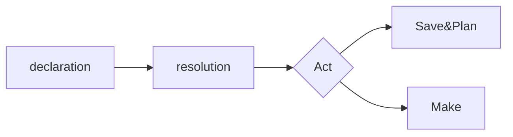


# Struttura del file di progetto
I file di progetto permettono di manipolare velocemente e molto liberamente i campi dati importati per il loro uso nel modello. Il file di progetto si articola in cinque sezioni: .decl, .res, .act, .sap, .make, che stanno rispettivamente declarative, resolutive, active, save & plan, make.
Ciascuna sezione possiede un numero limitato ma sufficiente di operazioni per manipolare i dati. In particolare, il file di progetto contiene sia sezioni interpretate dal codice in src (molto liberamente), sia sezioni interpretate dall'interprete di Python stesso.

Mentre le sezioni .decl, .res, .act definiscono variabili valide globalmente (eccezione fatta per i file di sorgente), le variabili introdotte in .sap e .make sono uniche per ciascuno dei due moduli.
Questo voldire che una variabile dichiarata in un formato in .decl sarà disponibile in .act, una variabile dichiarata per la prima volta in .act non sarà disponibile in .res, e una variabile dichiarata in .make non sarà disponibile in .sap

# Sezione .decl
La sezione .decl del file di intestazione per la manipolazione di dataset è in linea di principio un elenco delle fonti di provenienza dei dati.

Alla parola chiave .decl segue un elenco dei file di ingresso dei vari campi nel modello, in questo modo
    
    .decl
    source_file Sample_file = "your/path"
    [...]
  A ogni file specificato è associata una stringa di formato. E' obbligatorio specificare un formato per ogni file di sorgente. La stringa di formato è presa letteralmente, raccogliendo ogni carattere a eccezione del CR-LF '\n'.
  

    .decl
    source_file Sampe_file = "sample/path"
    {ID1};{ID2}
   
La stringa di formato è composta dalla concatenazione di uno o più id racchiusi fra i caratteri  '}' e '{'. I caratteri inseriti fra due token di id {ID} vengono comparati con il formato effettivo nel file per separare i token utili da caratteri di formato. Una stringa di formato incorretta è un errore irrecuperabile nel caricamento di un file. Alcuni caratteri hanno un significato speciale, ad esempio il carattere ';' significa che gli ID appartengono a colonne diverse nel dialetto CSV di Excel.

Volendo ad esempio importare da un file di testo in CSV-';' del tipo

>  Employee;Status;Stipendio;Data
>  Luca;Direttore;100;2015/11/3
>  Bossi;Matematico;200;2012/10/4
>  Palmese;Ingegnere;0;2021/3/2
   
   si deve creare un'intestazione del tipo

    source_file Employee_data = "file/path"
    {Nome};{Posizione};{Stipendio};{Anno}/{Mese}/{Giorno}
Si noti come in questo modo è possibile separare dati che altrimenti sarebbero stati inseriti nello stesso campo in Excel e assegnarli a dei nomi manipolabili.
Le variabili così nominate vengono estratte e poste in dei vettori di lunghezza n, con n il numero di righe nel file di sorgente.

    >> Nome
    >> [Luca, Bossi, Palmese]
    >> Stipendio
    >> [200, 200, 0]

Gli ID definiti nella sezione di .decl fanno parte delle variabili modificabili nelle sezioni successive. In particolare, tutti gli ID definiti nella sezione di dichiarazione devono essere risolti nella sezione di risolvimento .res. Una targhetta non risolta porta ad un errore fatale del programma, in quanto non è possibile assegnargli un tipo di dato nell'interprete interno.

   ~~Oltre ai file di origine è possibile caricare modelli precedentemente costruiti~~ ( non ancora implementato )  per modificarne i campi e, in caso, aggiungere nuovi elementi all'allineamento.
  
 

    model_file ModelloSample = "path/model"
La stringa di formato di un modello è differente da quella di un file di sorgente CSV. Questo perchè è necessario specificare le dimensioni dei vari campi all'interprete, in questo modo:

    {7 ID1}{3 ID2}[...]
Anche le variabili inserite tramite formato del modello devono essere risolte nella sezione .res.
 In particolare, nonostante siano variabili matriciali ('alte' il numero di righe del file, 'larghe' il numero di colonne indicato) valgono pressochè  le stesse operazioni predefinite per i vettori (a cui si aggiunge la possibilità di appendere ulteriori colonne o campi dati).
 # Sezione .res
 Nella sezione .res, le variabili dichiarate nella sezione di .decl vengono risolte. Risolvere una variabile vuol dire indicare all'interprete di che tipo di variabile si tratta, se numerica (keyword 'numeric') decimale, booleana (keyword 'boolean') categorica (ovvero, una fra una serie di parole (ad esempio, "Rosso"-"Verde"..) con keyword 'categorical'), o intera (keyword 'integer'). 

    .decl 
    source_file Impiegati = "sampl bne/path/"
    {Nome};{Posizione};[Stipendio}
    .res
    Nome: categorical
    Posizione: categorical
    Stipendio: numeric

Dichiarare erroneamente una variabile porta ad un errore fatale dell'interprete, in quanto durante il caricamento delle variabili internamento è necessario castare dalla stringa letta in CVS a un valore numerico, booleano o intero.

All'interno della sezione .res è anche possibile dichiarare nuove variabili, che assumono lo stesso valore (in caso, vettoriale) e tipo ( categorico,ecc..) della variabile copiata.

    .res
    Nome: categorical
    NomeDaModificare = Nome
    Stipendio: numeric
In questo modo è possibile copiare sia il valore che il tipo di una variabile al contempo.

# Sezione .act
Nella sezione .act è possibile manipolare le variabili dichiarate in precedenza e, eventualmente, dichiararne di nuove. 
Le varibili in .act possono essere sia utilizzate nel .sap, che nel .make, ovvero possono essere sia salvate separatamente in un nuovo file di sorgente CSV sia essere inserite in un dataset.

La sezione è quella che contiene il numero più alto di funzionalità. E' possibile, in primo luogo, dichiarare nuove variabili (numeriche) tramite assegnamento. Si fa osservare che nonostante il tipo sia di default numerico, non è necessario effettuare nessun cast sulla copia, e per questo non ha importanza l'effettivo tipo della variabile o espressione copiata.
L'assegnamento può essere sia di una variabile singola, precedentemente definita e risolta, sia di un espressione complessa.
	
    .act
    new SampleVar = DefinedVar
    new SampleVar2 = DefinedVar + func(DefinedVar2)
La valutazione di espressioni avviene tramite l'interprete di Python, e fa utilizzo dei simboli risolti in precedenza. In aggiunta dei simboli dichiarati dai file di sorgente ne sono disponibili diversi dalla libreria standard. In più, è possibile importarne di nuovi dallo scope globale.

    .act
    import numpy as np
    import math as m
    new Var = np.arange(0,10)
    new Sqrt = math.sqrt(5)
Le funzioni della libreria standard offrono un ampia gamma di funzionalità, che elenchiamo di seguito:

 

    discretizza(X, intervalli):
    """ Partendo da un vettore di elementi reali X, crea una
    sequenza di intervalli nella quale i valori reali 
    vengono suddivisi """
    >> X
    >> [0.4, 0.6, 0.1]
    >> discretizza(X, [0.2, 0.5, 1.0], [1, 2])
    >> [1, 2, 2]
  
  
  
  La funzione discretizza(..) è buona per cambiare la distribuzione numerica dei dati, nota la loro disposizione iniziale.

    aggiungi_rumore(X, distribuzione, parametri)
    """ Aggiunge rumore alla variabile(eventualmente vettoriale)
    X e ne ritorna il risultato con il rumore aggiunto.
    Ogni tipo di rumore ha una sua lista di parametri richiesti.
    I tipi di rumore supportati sono:
    
    gaussiano | di parametri (media, deviazione standard)
	esponenziale | di parametri (beta)
	uniforme | di parametri l'intervallo [a, b]
Il seguente esempio prende il parametro 'Height' e aggiunge alla variabile vettoriale un vettore casuale, di elementi estratti da una distribuzione normale di media (centro della campana) 1 e deviazione standard 3.

    .act
    new VarConRumore = aggiungi_rumore(Height, gaussiana, 1, 3)

Le varie distribuzioni di rumore sono  miscelabili, è sufficiente chiamare più volte la funzione  con distribuzioni diverse.

    media_zero(X)
    """ Restituisce il vettore X a cui è stato sottratto ad 
    ogni elemento di X la media di tutti gli elementi, in modo
    da avere un nuovo vettore a media zero."""

    
   Il seguente snippet di codice prende la variabile indicata, aggiunge del rumore e azzera la media del vettore risultato (si fa notare che in questo modo *non* si azzera il vettore stesso)
   

    .act
    new Var = aggiungi_rumore(Height, esponenziale, 3)
    Var = media_zero(Var)

Altre due funzionalità sono le seguenti

    media(X)
    """ Ritorna la media della variabile (eventualmente,
    variabile vettoriale) """
    dev_stand(X) 
    """ Ritorna la deviazione standard della variabile (idem)
Si fa notare che media_zero() è solo un alias per

    Id = Id - media(Id)
    
Alcune funzione si propongono di attenuare l'effetto di outlier, ad esempio
   
    azzera_outlier(x, n)
    """ Azzera tutti i valori che superano di n volte la
    deviazione standard di X. Maggiore è n, più è alta la
    soglia di tolleranza """

e   

    interpola_outlier(X, m)
    """ Cerca di interpolare ad un valore non nullo ma 
    ragionevole gli elementi di x che superano una certa
    soglia di tolleranza, dipendente da m. Si fa notare che
    la dipendenza non è così diretta come per azzera_outlier(),
    ma che m è un parametro che controlla una scelta più
    complessa"""
	
Il seguente snippet modifica la variabile indicata, rimuovendo i valori che superano di 7 volte la deviazione standard della variabile, probabilmente frutto di errori __(probabilmente!)__

    .act
    new AlteredVar = azzera_outlier(Variabile, 7)
   Un ulteriore funzione utile è la seguente:
   

    zero_con_probabilita(X, p)
    """ Ritorna un vettore x con gli stessi elementi di X, ma 
    in cui ogni elemento ha la probabilità p (fra 0 e 1)
    di essere stato azzerato"""
   Una funzione simile è utile per simulare condizioni di dati mancanti o 
   inaffidabili.

Altre funzioni invece offrono solo un ausilio, come le seguenti (di minore rilevanza)

    lunghezza(X)
    """ Ritorna la lunghezza, intera, della variabile
    (eventualmente vettoriale)X."""
    
    tronca(X,n)
    """ Ritorna la variabile X troncata fino
     all'n-esimo valore """
     
    interval(a,b,n)
     """ Ritorna un vettore di lunghezza n contenente i valori
     equispaziati compresi fra a e b."""
     
    da_categorico_a_numerico(x, dic)
    """ Ritorna un vettore in cui i valori di x sono stati
    mappati a valori numerici tramite il dizionario dic"""
   
Oltre alle funzionalità standard elencate, e ai pacchetti importabili, la sezione .act dispone della capacità di emettere sulla console i valori delle variabili tramite l'istruzione print(<espressione\>), in questo modo

    .act
    new Var = Media(Height)
    print(Var)
    
    >>Output: 174.23[..]
    
In aggiunta, la sezione .act dà la possibilità di tracciare grafici delle variabili create e modificate, tramite la funzionalità della keyword plot.
Due versioni della keyword plot sono implementate. La prima ha la forma

    plot Y against X
   Le variabili X e Y viene dunque messa in un grafico scatterplot in cui i valori delle ascisse sono prese dalla variabile X, e le ordinate dalla variabile Y. È quindi evidente che non ha senso usare il precedente statement per variabili di lunghezza diversa, che dà quindi un errore fatale dell'interprete.
La seconda modalità è della forma

    `plot Y`

Nessuna variabile sulle ascisse viene specificata, e la variabile Y è messa a grafico semplicemente con un asse fittizio  (come un grafico normale) mantenendo l'ordine degli elementi di Y.

Prima di presentare alcuni esempi, si vuol ribadire che __la sezione di .act è puramente 'assegnativa'.__ Questo voldire che __nessuna variabile viene modificata per riferimento, ma solo per riassegnamento,__ ovvero uno statement del tipo

    A = azzera_outlier(x)
__non ha alcun effetto su x, ma solo su a!__

La sezione di .act ha inoltre supporto per feature vettoriali, ovvero feature non numeriche ma che codificano l'informazioni tramite un certo encoding che rihciede una variabile vettoriale, ad esempio l'encoding bag-of-words o one-hot.
Per raggruppare variabili distinte in una stessa feature vettoriale, è presente nativamente la funzione di stack()

    stack(arg_1,..,arg_n)
     """ Ritorna una struttura contenente i vettori passati come argomento compatibile con la procedura di
     allineamento (NOTA: è ovviamente necessario che le variabili da unire siano della stessa lunghezza vettoriale.)
     Come nota tecnica, è semplicemente un alias di np.stack(*args, axis=-1)"""
    
Un ulteriore funzione nativa per il supporto di codifica vettoriale è la seguente

     one_hot_encode(x, ordine)
     """ Ritorna una feature vettoriale dove ogni elemento della feature è un vettore di lunghezza len(ordine)
     contenente la codifica one-hot di ciascuna entry in x, e dove l'ordine della codifica è data dalla lista ordine"""
     
Un esempio dell'uso quest'ultima funzione sarà più chiaro della presentazione stessa.
    
    >> print(Meteo)
    >> ["Nuvoloso", "Sole", "Pioggia, "Pioggia", "Nuvoloso"]
    >> new OneHotEncodeMeteo = one_hot_encode(Meteo, ["Nuvoloso", "Sole", "Pioggia"]
    >> print(OneHotEncodeMeteo)
    >> [ [1, 0, 0], # Nuvoloso
    [0, 1, 0], # Sole
    [0, 0, 1], # Pioggia
    [0, 0, 1], # Pioggia
    [1, 0, 0] ] # Nuvoloso
    

Alcuni esempi renderanno più chiara la sintassi (macchinosa) presentata.
Il seguente programma prende dal file DataFile i dati delle transizioni
in dollari, li converte in euro, ne traccia un grafico e ne stampa in uscita media e varianza

    .decl
    source_file DataFile = "/path/.."
    {Transactions};{Date}
    .res
    Transactions: numeric
    Date: categorical
    .act
    new DatiInEuro = Transactions*0.91314
    plot DatiInEuro
    print(media(DatiInEuro))
    new Varianza = dev_stand(DatiInEuro)**2
    print(Varianza)
    
Si fa notare che l'operazione <Transactions*0.91..> è intesa vettorialmente, ovvero ciascun elemento di Transactions ne è affetto.

Il seguente programma simula una condizione di inaffidabilità dei dati,
estraendo da DataFile il campo richiesto azzerando gli elementi con probabilità 0.03 e aggiungendo del rumore. In seguito compara i grafici dei dati iniziali e dei dati modificati.

    .decl
    source_file DataFile = "/file/path/"
    {Data};{AltezzaFiume}
    .res
    Data: categorical
    AltezzaFiume: numeric
    .act
    new ZeroedData = zero_con_probabilita(AltezzaFiume, 0.03)
    ZeroedData = aggiungi_rumore(ZeroedData, esponenziale, 3)
    ZeroedData = aggiungi_rumore(ZeroedData, gaussiana, 2, 1)
    plot ZeroedData
    plot AltezzaFiume
    plot ZeroedData against AltezzaFiume
Si fa notare che usando l'istruzione di `plot Y against X` è anche possibile trovare delle dipendenze lineari fra i dati. Infatti, quando Y e X sono correlati (ma solo linearmente!) il loro grafico apparirà assimilabile (in senso ampio) ad una retta con un certo coefficiente angolare.

L'ultimo esempio fa uso del pacchetto numpy per calcolare la somma di tutti gli elementi del campo GuadagniGiorno (e quindi il guadagno totale)

    .decl
    source_file Guadagni = "/path/"
    {GuadagnoGiorno}
    .res
    GuadagnoGiorno: numeric
    .act
    
    import numpy as np
    new GuadagniTotali = np.sum(GuadagnoGiorno)
    print(GuadagniTotali)
È stato detto a sufficienza sulla sezione di .act. Passiamo ora alle due sezioni indipendenti di .sap e .make.

# Sezione .sap
La sezione di .sap ha lo scopo di salvare e riorganizzare le variabili modificate nelle sezioni precedenti per usarle in futuro. 
Esistono due funzionalità, in sostanza, della sezione .sap. La prima è quella di poter dichiarare dei file di salvataggio, save_file nel seguente modo

    save_file SaveFile = "path/save_fileSample"
    save_file SecondSaveFile = "path/another"
La seconda è quella di poter salvare e riorganizzare (e riformattare) le variabili ottenute nelle tre sezioni precedenti.
Questo avviene tramite il comando di `save`, nel modo seguente

    save "<Format>" into FileDichiarato
E' necessario che un file sia stato dichiarato in passato per salvare il risultato al suo interno.
La stringa di formato è posta all'interno delle virgolette (e non può quindi contenere altre virgolette!) e presa letteralmente. Facciamo qualche esempio.

    >> Height
    >> [100, 200, 100]
    >> Quality
    >> ["bronze", "gold", "silver"]

    save "{Height};tipo{Quality}" into Savefile

> Savefile:
> 100;tipobronze
> 200;tipogold
> 100;tiposilver
> 
Lo statement di save è molto utile per salvare variabili modificate nella sezione di .act per poterle usare in modelli in futuro. 

# Sezione .make
La sezione .make ha la sola funzionalità di creare un (o più) dataset seguendo le indicazioni date e con le variabili definite in precedenza.
Questa funzionalità è però anche la più complessa.
 Prima di costruire un dataset coerente, è necessario procedere ad allineare tutte le variabili eterogenee che si vuole inserire nello stesso dalaset.
 
  La sezione .make fa questo rispetto a un gruppo di variabili, nel codice sorgenti dette 'di allineamento', che vengono usate per creare degli indici virtuali a ogni vettore di variabili rispetto al gruppo di variabili. 
  La richiesta di una finestra temporale complessa ( che comprende di prendere k elementi prima di un certo valore e n elementi dopo ) rende più complesso questo processo.
  
  Una descrizione completa del funzionamento del codice sorgente del .make (ancora in condizioni pietose) viene aggiunta come appendice alla fine del documento e non viene approfondita oltre in questa sezione.

L'elemento fondamentale della sezione .make è l'elemento di tipo `plan`. Per utilizzare questo elemento, vengono introdotti due tipi di file di salvataggio (che vengono distinti per imporre chiarezza nel codice prodotto), i file di log, `log_file`, e i file di salvataggio del piano, `plan_file`. Entrambi vengono dichiarati nello stesso modo di ciascun altra sezione, ovvero con

    log_plan X = "..."
    plan_file Y = "..."
   
  La costruzione di un elemento `plan` ha inizio con la keyword `begin plan`, seguita da una targhetta (nome) per il nuovo plan e da una precisazione non ancora sviluppata, la specificazione di errore `expecting <error-type>`. L'idea, ancora del tutto teorica!, è che l'interprete venga istruito di correggere eventuali errori di allineamento.
  La tipica dichiarazione di un plan ha la forma
  

    begin plan NewPlan expecting <NotImplemented>
    {
    ...
    ...statements...
    ...
    }
    end plan
Possono esserci più di una dichiarazione di piano in uno stesso file di progetto, a patto che abbiano nomi diversi.

Gli statement all'interno di una dichiarazione di piano sono di vario tipo.
Il primo tipo di statement è quello che compare per primo nella dichiarazione di un plan ed è uno statement di `align`. Possono esserci più statement di `align`, ma **tutti fanno riferimento allo stesso allineamento.** Vengono accettate più dichiarazioni di `align` su più righe solo per una questione di comodità di lettura del codice, non perchè è possibile allineare rispetto a più allineamenti (per ora, almeno).
Sarà più chiaro in seguito che cosa si intende per allineamento.
Uno statement di `align` ha questa forma:

    align <V1>, ...<VN> against <Align1>,...<AlignN> as <mode>
   Il numero di variabili di allineamento deve essere **uguale** a quello delle variabili da allineare, quindi esiste una coppia ( variabile, variabile di allineamento) per ogni variabile nel piano.
   Come già detto, può esserci più di uno statement di align in sequenza, quindi potrebbe benissimo seguire l'align precedente un ulteriore statement
   

    align <VarN+1> against <VarAlignN+1> as <mode>
   E VarN+1 e VarAlignN+1 verrebbero aggiunte alla lista delle variabili e delle variabili di allineamento formata dal primo statement.
   La modalità `<mode>` è per il momento non implementata, **ma è necessario** aggiungerla. Le modalità che verranno aggiunte sono 

    index: allinea secondo un indice numerico 0,1,2..
    date: allinea secondo una data

   In attesa che venga sviluppata la sezione di `<mode>`, una qualsiasi delle due modalità sopracitata sarà accettata senza alcuna distinzione fra le due.
Dopo l'elenco di allineamento ha inizio la descrizione vera e propria del piano, con lo statement di inizio

    consider x
   che non si traduce in nessuna operazione particolare per l'interprete se non creare l'oggetto responsabili dell'allineamento.
   Seguono un numero variabile di istruzioni di indicazione del tipo di finestra richiesto per **ciascuna variabile (non di allineamento) indicata nella sequenza di align.**
   
Specifichiamo accuratamente che cosa si intende per 'finestra' attraverso un esempio.
Richiedendo che per predirre un dato futuro si usino, ad esempio, una finestra temporale di un anno di un certo dato definisce implicitamente una finestra mobile che scorre lungo il vettore dei dati. 
Più concretamente, avendo a disposizione 10 dati e dovendo per ogni output fornire i dati della settimana(5 giorni) precedenti, il numero di data point effettivi è pari a 10 - 5 + 1 = 6 come mostrato in figura

Affinchè abbia senso tenere una finestra che scorre lungo dei dati di origine diversa, è necessario che vengano prima allineati (ad esempio, rispetto ad una data). Questo è lo scopo delle direttive di `align`

Per richiedere un modo di disporre un parametro, si usa la keyword `take`. Prima di poter usare la keyword di`take` è necessario aver prima dichiarato la fine della sezione di allineamento con `consider x`.
La keyword `take` si presenta in variante del seguente schema generale:

    take <numeroP> before x and <numeroD> after x from <Var>
   Istruisce l'interprete di inserire nelle righe del dataset numeroP+numeroD+1 campioni presi da Var. I campioni considerati nel `before` vengono presi 'prima' del primo punto di allineamento (ovvero il generico giorno 'x'), mentre quelli `after` dopo.
   La keyword di take è disponibile in 3 varianti con effetti leggermente diverse, ovvero
   

    take <numero> before x from <Var>
    take <numero> after x from <Var>
    take x from VarSingola
Mentre le prime due istruiscono semplicemente di non considerare la finestra anteriore (o posteriore), l'ultima variante segnala di non considerare nessuna finestra ma di prendere un singolo dato da `VarSingola` per riga di input al modello.
E' importante osservare che nel caso di variabili vettoriali, la finestra viene presa sull'intero vettore di ciascun data point nella feature! Questo voldire che prendendo il seguente vettore dati di esempio

    >> print(Esempio)
    >> [ [1, 0, 0], [0, 1, 0], [0, 0, 1] ]
Le finestre di 'dimensione due' sui dati saranno 
    >> [ [1, 0, 0, 0, 1, 0], [0, 1, 0, 0, 0, 1] ]!

Sarà utile un esempio. Il seguente snippet di codice allinea i parametri `RiverHeight` e `Meteo` considerando le date presenti nei rispettivi file di sorgente, in seguito richiede di inserire per ogni riga di input al modello 365 campioni del meteo prima di un determinato giorno 'x' e 7 campioni del meteo dopo il giorno 'x' (il giorno x è sempre incluso!).
Per il parametro`RiverHeight`invece istruisce di considerare una finestra temporale di 7 giorni.
  

    begin plan River expecting full_recovery
    {
	    align Temperature, Meteo against Date1, Date2
	    
	    consider x
		take 365 before x and 7 after x from Meteo
		take 7 before x from Temperature
		
    }
Per terminare un piano è necessario indicare la variabile di target( per ora è supportata una sola variabile di target, in futuro un numero arbitrario). E' possibile, anche per il target, specificare la finestra desiderata (che sarà quindi output del modello, un vettore) ma solo nel 'futuro' (per ora, non ha senso chiedere di predire qualcosa nel passato relativo a dati già in possesso).
Per fare ciò si usa la keyword `make` in questo modo

    make <varname> the target and take y from <varname>
   Per specificare una finestra, è possibile modificare lo statement in
   

    make <var> the target and take <num> after y from <var>
Per terminare la dichiarazione di un piano si usa la frase chiave

    pair x with target
e, chiusa la graffa, si specifica la direttiva di `end plan`.
La compilazione del piano non avviene fino alla direttiva di `compile` specificata più avanti nella documentazione. Lo scopo delle righe precedenti è quello di istruire la struttura dati addetta all'allineamento su come organizzare le variabili interne.

Una volta lette tutte le istruzioni interne alla disposizione del piano, è possibile modificare alcuni parametri di salvataggio tramite la keword `set` in questo modo

    set <param_name> = <new_value>

I parametri del modelli attualmente specificati sono 4, 
`x name, y name, compression, error`dei quali solo due (x name e y name) sono implementati. Quei due parametri descrivono il nome associato rispettivamente ai dati in ingresso (X) e ai dati in uscita (Output aspettato, Y) nel salvataggio del modello finale.

E' possibile anche accedere ai log generati dal modello durante la compilazione e la pianificazione attraverso la keyword di `log` nel seguente modo

    log <NomePiano> into <NomeLogFile>
   Tra i log generati dal piano ci sono i nomi dei dataset nel salvataggio del modello, il numero di data point (in senso generale, l'unità vettoriale che bisogna dare alla rete per avere un output), i cambiamenti avvenuti ai parametri e le variabili coinvolte nel modello. In futuro verrà implementata una descrizione generata automaticamente del modello, incluse le finestre di scorrimento utilizzate.
   Infine è possibile compilare definitivamente, quindi generare le righe del dataset finale, con il comando

    compile <PlanName> into <PlanFile>
    
Come nota tecnica, si fa notare che il salvataggio del modello avviene tramite np.savez. Si potrà accedere al dataset tramite la funzione np.load, o un oggetto DatasetLoader, utilizzando le targhette 'x name' e 'y name'. Si segnala inoltre che il valore predefinito di questi ultimi due campi, se non alterato, è rispettivamente 'x' e 'y'.

Nella pratica, è utile separare i dati di training in due sezioni, la sezione di allenamento e la sezione di test. La sezione .make del file di progetto implementa questa proposizione con la direttiva di `split`.
La direttiva di split ha questo formato

    split <ModelName> into <File1>, <File2> as <Percentuale>,<Percentuale2> 
Le percentuali espresse devono obbligatoriamente sommarsi al 100%, e le targhette <File1> ec.. fanno riferimento a label date a file precedentemente definite.
Il seguente esempio divide il modello in due sezioni, la sezione di test e la sezione di traning, la prima contenente il 60% dei dati di training e la seconda il 40%.

    split Model into TestFile, TrainingFile as 40, 60
Una precisazione è necessaria. Specificando nell'istruzione di compilazione un file in particolare, in questo modo

    compile ModelName into PlanFile	
__viene bypassato qualsiasi direttiva di split precedentemente definita, e il modello generato (input e output desiderato) vengono salvati nel file specificato.__
E' quindi necessario omettere il file di salvataggio nella direttiva di compile per poter sfruttare la funzionalità di split, nel seguente modo.
	
    compile ModelName
Presentiamo ora un un file di progetto tipico, che prenda da dei file sorgente rispettivamente le variabili {Stipendio}, {DateStipendi}, {Profitti} {DateProfitti} e genera un dataset.

    .decl
    source_file StipendiFile = "/PATH/EX/Stipendi"
    {DateStip};{Stipendio}
    source_file ProfittiFile = "/PATH/EX/Profitti"
    {DateProf};{Profitti}
    .res
    Profitti: numeric
    Stipendio: numeric
    DateStipendi: categorical
    DateProfitti: categorical
    
    .act
    plot Stipendio
    plot Profitti
    .sap
    .make
    plan_file FileDataset = "/sample/path"
    log_file DatasetLogs = "/logs"
    
    begin plan Rendimento expecting full_recovery
    {
	    align Stipendio, Profitti against DateProf, Datestip
	    consider x
	    take 4 before x from Stipendio
	    
	    make Profitti the target and take y
	    pair x with target
	    
    }
    end plan
    
    set Rendimento y name = "Target profitti"
    set Rendimento x name = "Stipendi pagati"
    
	log Rendimento into DatasetLogs
	compile Rendimento into FileDataset
    
Lo statement `take 4 before x from Stipendi` istruisce l'allineatore che per ogni riga del dataset (un unità da dare come imput ad un modello) rappresentante un giorno, devono essere presenti, oltre ai dati del giorno stesso, anche i dati di 4 giorni prima. 
il `take y from Profitti` significa che ai 4+1 Stipendi presi (4 giorni prima, +1 del giorno considerato) è associato il profitto del giorno considerato.
Ovvero, il dataset generato avrà questa forma

| Stipendi  | (una riga, | un input  | al modello) |           | Profitti  |
|-----------|------------|-----------|-------------|-----------|-----------|
| 9 aprile  | 10 aprile  | 11 aprile | 12 aprile   | 13 aprile | 13 aprile |
| -29$      | -20$       | -10$      | -15$        | -20$      | +14$      |
| 10 aprile | 11 aprile  | 12 aprile | 13 aprile   | 14 aprile | 14 aprile |
| -20$      | -10$       | -15$      | -20$        | -9$       | +14$      |
| 11 aprile | 12 aprile  | 13 aprile | 14 aprile   | 15 aprile | 15 aprile |
| -10$      | -15$       | -20$      | -9$         | -42$      | +40$      |

Si noti come la finestra temporale di 5 giorni (4+1) scorre lungo i dati di origine, creando un numero n di finestre sui dati.

# Appendice: Mantenimento delle finestre di scorrimento
Mancante :(
